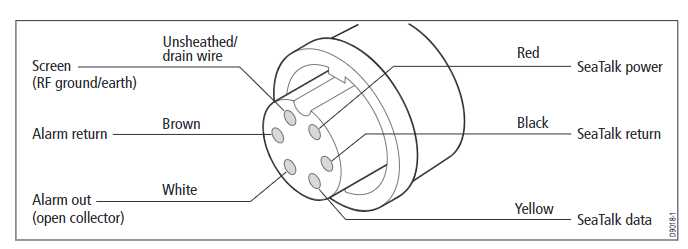
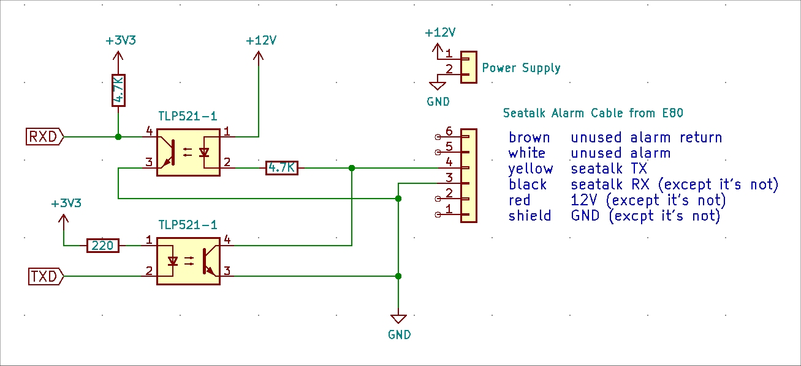
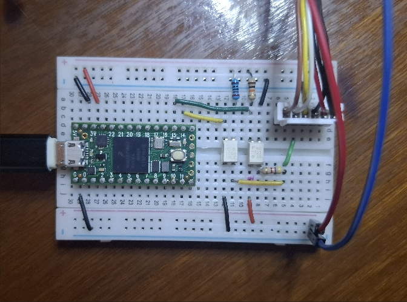
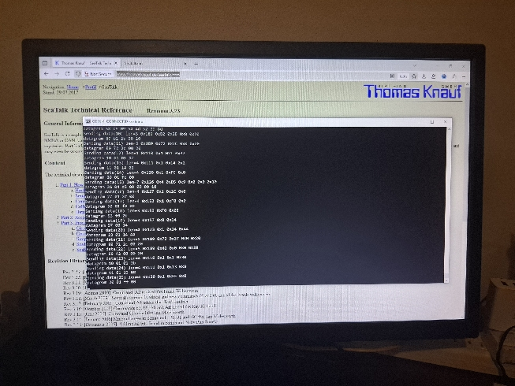
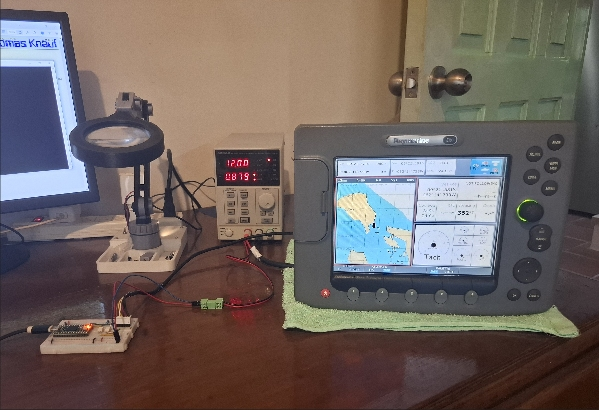

# Seatalk

**Home** --
**[History](history.md)**

- Seatalk is a 12V single ended 4800 baud 9 bit bi-directional protocol.
- See http://www.thomasknauf.de/seatalk.htm, with thanks, for more info.
- See the docs folder for these webpages, downloaded for safety.

This project communicates with my E80's, ST7000's, and ST50 instruments via
the Seatalk1 (original proprietary Raymarine) protocol using a Teensy 4.0.
The teensy 4.0 is a logical choice for a Seatalk device, as it natively
supports 9 bits in hardware UARTS.

- C:\Program Files (x86)\Arduino\hardware\teensy\avr\cores\teensy4\HardwareSerial.h
modified as administrator to uncomment #define SERIAL_9BIT_SUPPORT near the top.

The circuit was prototyped and tested on a breadboard connected directly to an E80.
This allowed me to extensively test the E80 and several ST50 instruments on my desk,
away from the boat, and was crucial for me to learn about the E80's support of NMEA2000
and NMEA0183.

The designed PCB (printed circuit board) also serves as a passive Seatalk
junction box on my boat, wherin the teensy and supporting circutry are not
required for the boat instruments to function properly.

### E80 "Seatalk/Alarm" cable pinout

Here is a diagram of the purported E80 "Seatalk/Alarm" cable pinout.
With regards to Seatalk, after detailed testing, I can tell you that the
diagram is, at best, misleading.

Clockwise, in the above diagram, starting at the notch

- red - Unconnected for Seatalk communications as the E80 is powered separately. Does not provide 12V
in case you think it might.
- **black** - The ground for the Seatalk serial Data signal. Must be provided as it is not internally connected to the
  E80 power supply negative (ship's DC ground).
- **yellow** - The bus for the Seatalk serial Data.
- white - alarm out, not used in my configuration
- brown - alarm return, not used  in my configuration
- screen - RF ground/earth?  Not internally linked to the E80 power supply negative
  (ship's DC ground).

In the end, the only two wires of interest for communicating Seatalk with the
E80 are the **black** data signal ground and **yellow** data bus.

### Opto-isolated 12V to 3.3V Seatalk Serial IO

The Seatalk serial data bus (yellow wire) is pulled high by all receivers.
The bus is considered idle if there is no traffic on it for about 2.5ms (10 bits
at 4800 baud).  There is no collision management, except to the degree that each
device listens to the bits it sends out and aborts it's message if any bits are
garbled by another device pulling the bus low. Receivers abort any message that
is not fully transmitted.

The below schematic shows the use of two inexpensive opto isolaters to turn the
12V signal into the needed 3.3V levels for interfacing to the teensy.

The RXD signal to the teensy is pulled high via a 4.7K resistor to
3.3V, and pulled to ground if the first opto-isloator is turned on.

The bus (yellow) is pulled high to 12V through the first opto isolator
emitter diode and a 4.7K resistor to 12V.  If no-one pulls the bus low,
both sides of the emitter diode will be 12V, no light will shine, and
the photo transistor will be closed, thus NOT pulling the RXD signal low.
When anyone pulls the bus low, the diode will light up, the photo transitor
will turn on, and the RXD signal to the teensy will be pulled to ground.

To transmit, the teensy TXD (normally high) is pulled low from 3.3V
through the second opto isolator emitter diode to ground, lighting the
emitter diode.  The second photo transistor then pulls the bus to ground,
sending the serial data bit out to the bus.

**It's that simple!**.  The rest of the magic happens thanks to the
teensy's hardware support of 9 bit serial data, and in the software,
after correct initialization, we just use the typical Serial.available()
and Serial.read() methods to read bytes and construct Seatalk packets,
with appropriate timeouts for collision management.

### Development of Simulator

After figuring out the electrical interface, putting the E80 into simulation mode
caused it to send recognizable Seatalk messages to the teensy. As a proof of concept,
i then regurgitated those, when it was not in simulation mode, to the E80 and
it worked!

*I also tested the Raynet RNS Windows Software and the ethernet stuff along the
way, the subject of another webpage to be written.*

I think the first hand built Seatalk message I sent to the E80 was a Depth message
which showed up on the display.  By now I was using Seatalk to send the E80 messages
so that I could (finally) get it put somethting, anything, on the NMEA2000 bus
(see my NMEA_Sensor and NMEA_Monitor repos), which was actually my focus at that
time.

After I could very reliably send and receive Seatalk to the E80, I expanded
the software to support its own Simulator, which basically came down to:

- sending depth information (sonar)
- sending location information (GPS coordinates)
- sending course (speed through water) and heading (compass) information
- sending true and relative wind information, which required some calculations

With that information I could "drive" the virtual boat and see it move
on the E80 display, and monitor the various virtual wind, log, and sonar
instruments to make sure they were all working correctly.

With a bit more work, I added a set of (hardcoded) waypoints to the simulation,
constituting a "track" or "course" and was able to have the simulator virtually
drive the boat to each waypoint, in succession, working with the E80's waypoint
arrival alarms to "arrive" at a given waypoint, set a new course to the next waypoint,
and finally stop the boat after the last waypoint was acheived.

A similar simulator exists in both my NMEA0183 repo and my NMEA2000 (NMEA_Sensor
and NMEA_Monitor) repos.

### ST50 Instrument Testing

I then modified the breadboard, and the program, slightly, to allow me to
do some rudimentary testing of a few of the ST50 instruments.

- ST50 Multi - works directly from my Seatalk simulator
- ST50 Speed - simple 5V pulse to emulate paddle wheel
- ST50 Wind  - 5V pulse to emulate wind speed, 2-8V orthognal signals for direction.

ST50 Speed (log) is a fairly simple device that expects a 5V pulse as the log wheel turns,
so (in the breadboard schematic) I added a sub-circuit (transistor and pull-up to 5V through
220 ohm resistor) that sends a 5V square wave to the **yellow** of its input plug. At 100ms
per toggle I think the "speed through water" was around 2 knots. Varying the rate of the pulses
varied the ST50 display, which was all I was trying to do as a basic test of the instrument.

The ST50 Wind instrument is a bit more complicated. In addition to a pulse to emulate
the wind speed, it expects two 2-8V signals that determine the direction.  So I created
a voltage divider from 12V to 8V and used a pair of potentiometers in another set of
voltage dividers to allow me to send 2V to 8V to the two direction signal pins on the
ST50 Wind instrument.  By changing the pots I got the instrument to display various
directions and verified, basically, that the instrument was working. What I mostly wanted
to know is the wind speed though, to see if the LCD was bad (which it was).

In an interesting side experiment I tore the polarization filter off of an old cheap
tablet LCD, turned it at angle, and was able to barely see the ST50 Wind LCD was working,
just old and weak.
